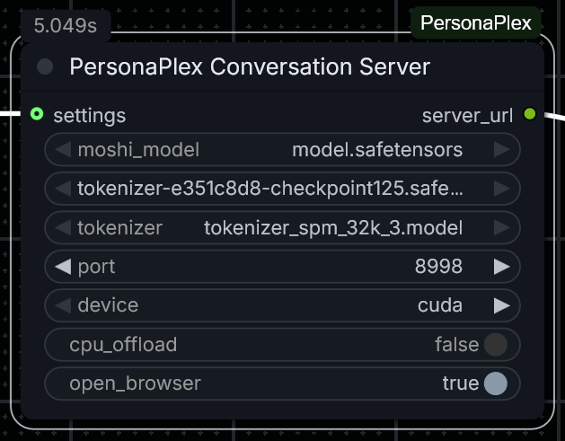
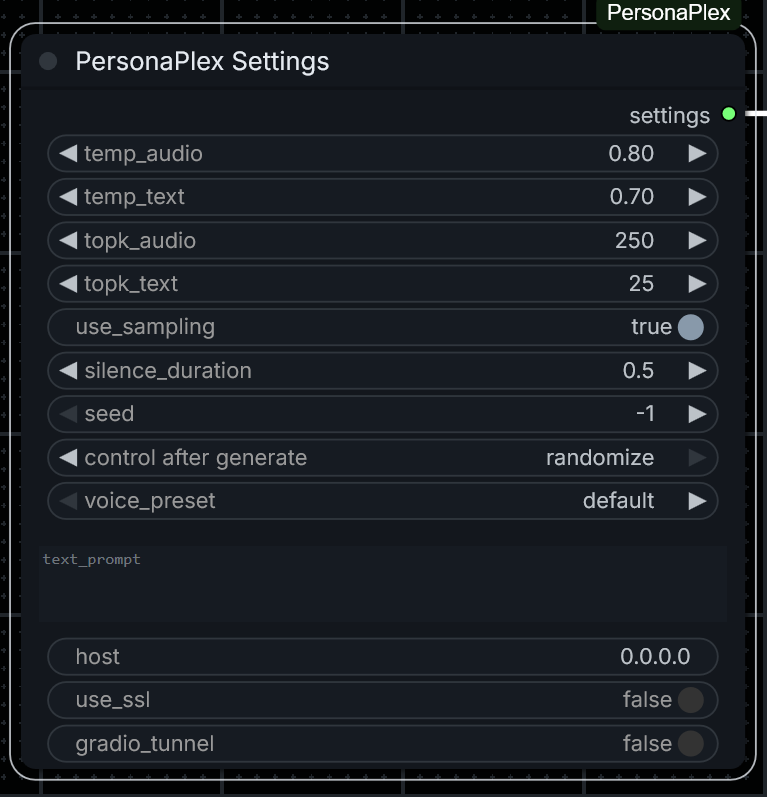
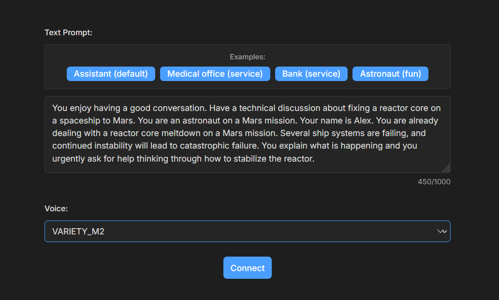

# ComfyUI_PersonaPlexMF

A ComfyUI custom node for running [NVIDIA PersonaPlex](https://github.com/NVIDIA/personaplex) - a real-time, full-duplex speech-to-speech conversational AI with persona control.

[](https://github.com/squarewulf/ComfyUI_PersonaPlexMF)
[](https://github.com/squarewulf/ComfyUI_PersonaPlexMF)

## Features

- **Live Conversation** — Real-time voice chat with AI using your microphone
- **Batch Inference** — Process audio files through the PersonaPlex model
- **Voice Presets** — 18 different voice options (natural and variety styles)
- **Persona Control** — Customize AI behavior with text prompts
- **Full Settings Control** — Adjust sampling, temperature, and timing parameters
- **Smart Server Startup** — Browser opens only after server is fully ready
- **Server Cleanup** — Automatic cleanup on exit, plus manual stop node

## Screenshots

### PersonaPlex Conversation Server Node
Start the live conversation server with model selection and options.



### PersonaPlex Settings Node (Optional)
Configure all sampling, temperature, and timing parameters in one place.



### Web UI - Live Conversation
Real-time voice conversation with customizable personas and voice selection.



## Installation

### 1. Clone or Download

```bash
cd ComfyUI/custom_nodes
git clone https://github.com/squarewulf/ComfyUI_PersonaPlexMF.git
```

### 2. Install Dependencies

**Important:** The `sphn` library must be version 0.1.x (version 0.2+ has breaking API changes).

```bash
cd ComfyUI/custom_nodes/ComfyUI_PersonaPlexMF

# Install requirements (includes pinned sphn version)
pip install -r requirements.txt

# Install bundled moshi package (required for PersonaPlex features)
pip install -e personaplex_src/moshi
```

For **Windows portable ComfyUI**, use the embedded Python:
```bash
# From ComfyUI_windows_portable directory
.\python_embeded\python.exe -m pip install -r ComfyUI\custom_nodes\ComfyUI_PersonaPlexMF\requirements.txt
.\python_embeded\python.exe -m pip install -e ComfyUI\custom_nodes\ComfyUI_PersonaPlexMF\personaplex_src\moshi
```

### 3. Download Models

Download from [HuggingFace nvidia/personaplex-7b-v1](https://huggingface.co/nvidia/personaplex-7b-v1) and place in `ComfyUI/models/personaplex/`:

| File | Description |
|------|-------------|
| `model.safetensors` | Moshi 7B LM weights (~14GB) |
| `tokenizer-e351c8d8-checkpoint125.safetensors` | Mimi encoder/decoder |
| `tokenizer_spm_32k_3.model` | Text tokenizer |
| `voices.tgz` | Voice presets (extract to `voices/` folder) |

The web UI for live conversation is included in this repo (no separate download needed).

## Nodes

### PersonaPlex Conversation Server

Starts a WebSocket server with a web UI for live voice conversation.

**Inputs:**
| Input | Type | Description |
|-------|------|-------------|
| `moshi_model` | dropdown | Moshi LM weights file |
| `mimi_model` | dropdown | Mimi encoder/decoder file |
| `tokenizer` | dropdown | Text tokenizer file |
| `port` | int | Server port (default: 8998) |
| `device` | dropdown | cuda or cpu |
| `cpu_offload` | bool | Enable for low VRAM GPUs |
| `open_browser` | bool | Auto-open browser (waits for server ready) |
| `settings` | optional | Connect PersonaPlex Settings node |

**Output:** `server_url` — URL to access the conversation UI

### PersonaPlex Model Loader

Loads PersonaPlex models for batch inference.

**Inputs:**
| Input | Type | Description |
|-------|------|-------------|
| `moshi_model` | dropdown | Moshi LM weights file |
| `mimi_model` | dropdown | Mimi encoder/decoder file |
| `tokenizer` | dropdown | Text tokenizer file |
| `device` | dropdown | cuda or cpu |
| `cpu_offload` | bool | Enable for low VRAM GPUs |

**Output:** `personaplex_model` — Model bundle for inference

### PersonaPlex Inference

Runs speech-to-speech inference on audio input.

**Inputs:**
| Input | Type | Description |
|-------|------|-------------|
| `personaplex_model` | model | From Model Loader |
| `audio` | AUDIO | Input audio |
| `settings` | optional | Connect PersonaPlex Settings node |
| `voice_preset` | dropdown | Voice to use |
| `text_prompt` | string | Persona/behavior prompt |

**Outputs:** 
- `audio` — Generated speech response
- `text_output` — Transcription of response

### PersonaPlex Settings

Configure all inference parameters. Connect to Inference or Server nodes.

**Sampling Settings:**
| Setting | Default | Description |
|---------|---------|-------------|
| `temp_audio` | 0.8 | Audio sampling temperature |
| `temp_text` | 0.7 | Text sampling temperature |
| `topk_audio` | 250 | Top-K for audio tokens |
| `topk_text` | 25 | Top-K for text tokens |
| `use_sampling` | true | Use sampling vs greedy |

**Timing Settings:**
| Setting | Default | Description |
|---------|---------|-------------|
| `silence_duration` | 0.5 | Seconds before response starts |

**Other Settings:**
| Setting | Default | Description |
|---------|---------|-------------|
| `seed` | -1 | Random seed (-1 = random) |
| `voice_preset` | default | Voice override |
| `text_prompt` | "" | Persona prompt override |
| `host` | 0.0.0.0 | Server bind address |
| `use_ssl` | false | Enable HTTPS |
| `gradio_tunnel` | false | Enable remote access |

### PersonaPlex Stop Server

Stops the running conversation server. Useful when you need to free up GPU memory or restart with different settings.

**Output:** `status` — Result of the stop operation

## Voice Presets

| Category | Voices |
|----------|--------|
| Natural Female | NATF0, NATF1, NATF2, NATF3 |
| Natural Male | NATM0, NATM1, NATM2, NATM3 |
| Variety Female | VARF0, VARF1, VARF2, VARF3, VARF4 |
| Variety Male | VARM0, VARM1, VARM2, VARM3, VARM4 |

## Example Prompts

**Assistant:**
```
You are a wise and friendly teacher. Answer questions or provide advice in a clear and engaging way.
```

**Customer Service:**
```
You work for AeroRentals Pro which is a drone rental company and your name is Alex.
```

**Casual Conversation:**
```
You enjoy having a good conversation. Have a casual discussion about technology.
```

## Hardware Requirements

| Configuration | VRAM | Notes |
|--------------|------|-------|
| Recommended | 24GB+ | Full speed inference |
| Minimum | 12GB | Use `cpu_offload=True` (slower) |

## Troubleshooting

### "Torch not compiled with CUDA"
```bash
pip install torch torchvision torchaudio --index-url https://download.pytorch.org/whl/cu124
```

### "No module named 'sphn'" or "OpusStreamReader has no attribute 'read_pcm'"

The `sphn` library version 0.2+ has breaking API changes. Install version 0.1.x:
```bash
pip install "sphn>=0.1.4,<0.2"
```

For Windows portable ComfyUI:
```bash
.\python_embeded\python.exe -m pip install "sphn>=0.1.4,<0.2"
```

### "unrecognized arguments: --voice-prompt-dir"

A different `moshi` package is installed that conflicts with PersonaPlex. Fix by installing the bundled version:
```bash
cd ComfyUI/custom_nodes/ComfyUI_PersonaPlexMF
pip install -e personaplex_src/moshi
```

### Server won't start
- Check ComfyUI console for error messages
- Ensure all model files are in `ComfyUI/models/personaplex/`
- On Windows, make sure paths don't contain special characters

### Port already in use
- Change the port number in the node settings
- Or use the "PersonaPlex Stop Server" node to stop the previous instance

### WebSocket disconnects immediately
- Check the ComfyUI console for `[PersonaPlex Server]` error messages
- Ensure sphn version is < 0.2 (see above)
- Wait for "Server is ready!" message before connecting

## Changelog

### v1.1.0
- Fixed server startup and WebSocket connection stability
- Browser now waits until server is fully ready
- Pinned sphn version to < 0.2 (required for audio streaming)
- Improved error messages and server cleanup

### v1.0.0
- Initial release

## License

- PersonaPlex model weights: [NVIDIA Open Model License](https://huggingface.co/nvidia/personaplex-7b-v1)
- This ComfyUI wrapper: MIT License

## Author

[squarewulf](https://github.com/squarewulf)
